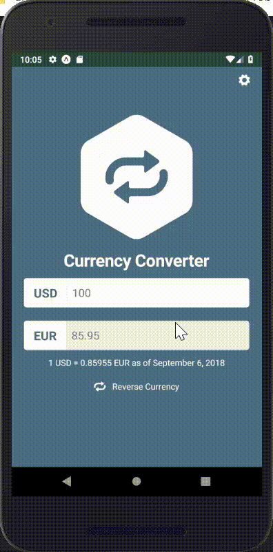

# Currency Converter - Mobile Application 
<dl>
  <dt>Using React- Native</dt>
</dl>
Mobile App which connects to an API, fetches the conversion rates for multiple currencies,
and displays it to the user.
Used Redux, and redux-saga to store the data and dynamically react to the users' actions.
Changeable theme.
 
 

  

